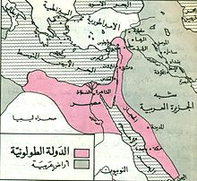

أيام الدولة العباسية وفي عصر تولي الترك للوزارات وتحكمهم في الخلافة بعد وفاة المتوكل . كان هناك قائد يدعى أحمد بن طولون ذو أصل تركي أحسن القتال مع العباسيين فولي على مصر من قبل المنتصر وقيل المعتز لكنه سرعان ما أعلن عصيانه على الخليفة العباسي , وأعلن ضمه للشام والحجاز فبعد موته أرسل الخليفة العباسي جيشا بقيادة محمد بن رائق استعاد الحجاز وأجزاء من الشام في عهد خمارويه بن أحمد بن طولون كما كانت اول محاولات الفاطميون في الاستيلاء على مصر أيام عبيد الله المهدي لكنها بائت بالفشل لقوة سلطة خمارويه وجبروته ثم بعد موت خمارويه أخذ ابناء خمارويه الحكم لكن الحكم لم يستقر لهم ولا للأبن الأكبر هارون فأخذ الحكم عمهم شيبان بن أحمد لكن قيل بأنه ضعيف الشخصية مما سهل على العباسيين وقادة الحمدانيين ومحمد بن طغج الأخشيد (مؤسس الدولة الأخشيدية في ما بعد) السيطرة على القطائع عاصمة الطولونيين

<figure>

<figcaption>

أماكن سيطرة الدولة الطولونية وذلك في عهد المؤسس أحمد بن طولون

</figcaption>

</figure>
