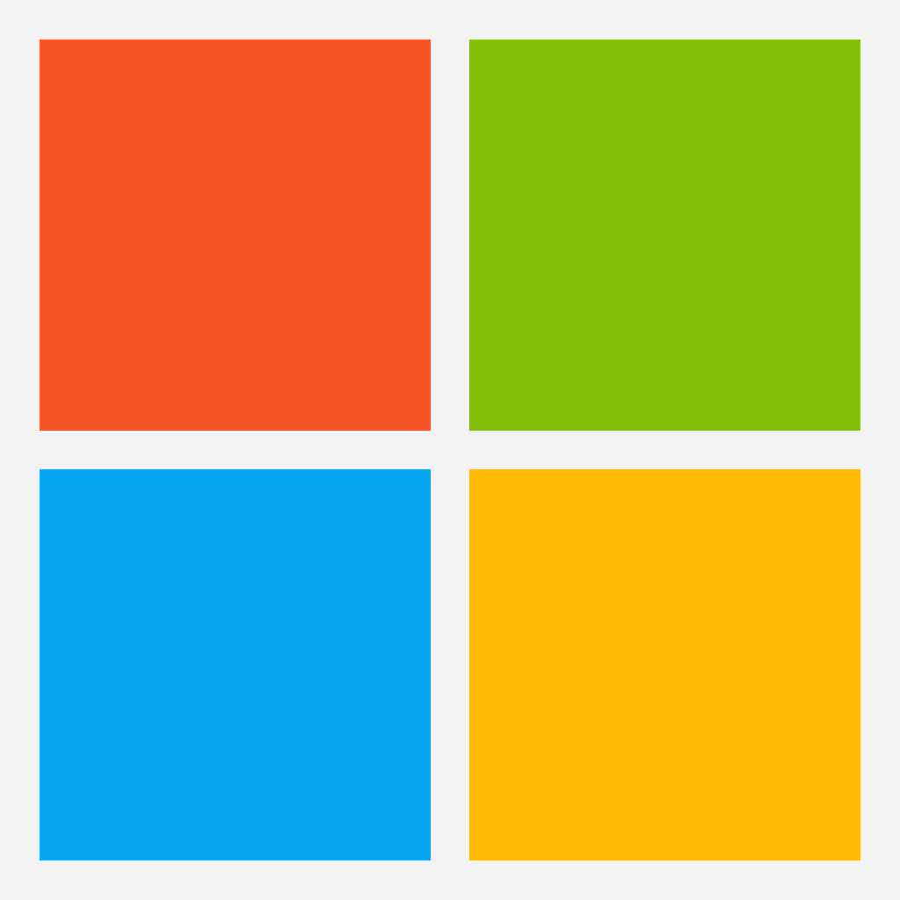
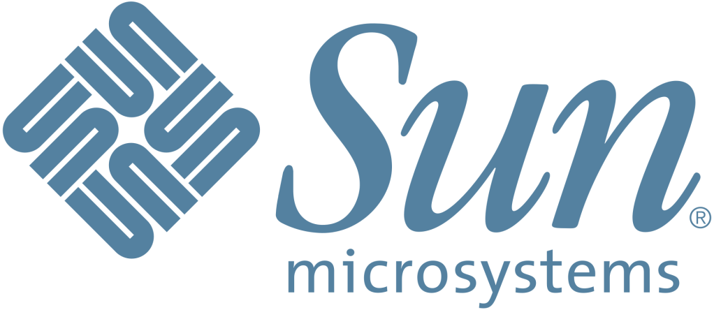
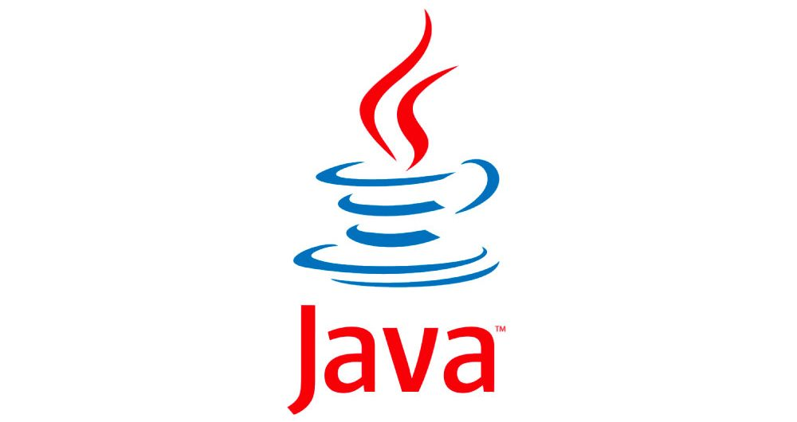
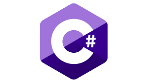
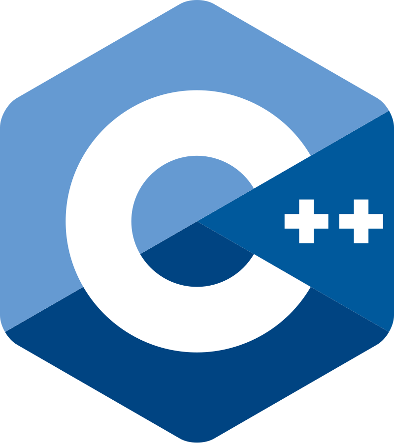
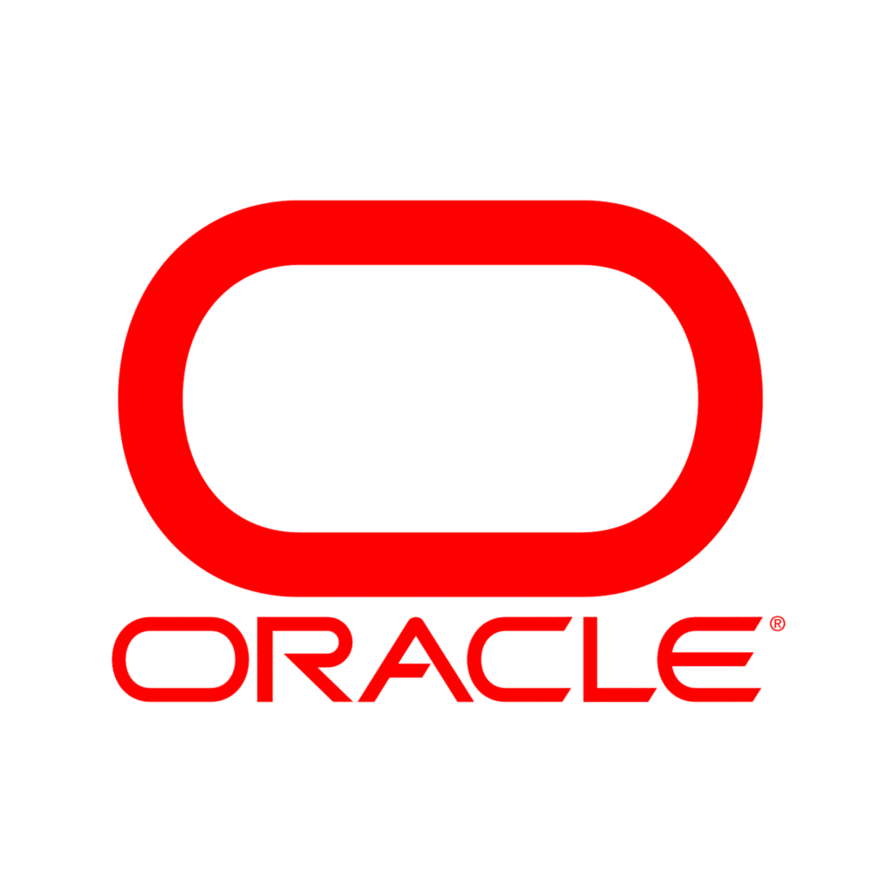

## خلفية

أُنشئت شركة مايكروسوفت الشهيرة عام 1975 من قِبل الزميلين بيل غيتس وبول ألين , كانت الشركة في بادئ الأمر لتطوير أمور بسيطة ثم لاحقاً طورا نظام تشغيل مبني على يونكس مسمى بـ"زينيكس" . لاحقا أشتهرت مايكروسوفت عملاق الإلكترونيات بنظام التشغيل الشهير "ويندوز" الذي هو أشهر من نار على علم . تعد مايكروسوفت من أشهر الشركات في عالم التقنية فدورها معروف من أنظمة التشغيل مروراً بسوق الأجهزة الألكترونية والحواسيب ثم الحوسبة وعلم البيانات وعلوم كثيرة أخرى لاينافسها في ذلك إلا شركة مثل شهرتها أو أشهر منها بقليل وهي "جوجل" .

أما عن سن مايكروسيستمز فهي شركة ناشئة في المجال تأسست عام 1982 ودخلت في كلاً من مجالي الـHardware والـSoftware وبرعت فيهما كليهما , ومن أبرز منتجات هذه الشركة :

- Java : لغة برمجة شيئية شهيرة جداً , صححت مشاكل لغة C++ في إدارة الذاكرة وتم إطلاقها عام 1995 .

- MySQL : نظام إدارة قواعد بيانات علائقية شهير جدا .

- Virtualbox : برنامج لإدارة أنظمة التشغيل الوهمية .

## المنافسة

بدأ الخلاف حينما قامت مايكروسوفت بتضمين لغة Java في الـIDE الشهير الخاص بها أنذاك "Visual Studio" بدون إذن من سن مايكروسيستمز في نهاية التسعينات وبداية الألفية مما أغضب الشركة الناشئة كثيراً وقررت الذهاب إلى القضاء . فازت سن مايكروسيستمز بالقضية ولكن هذا لن يجعل عملاق التقنية يستسلم أمامها , ففي عام 2000 تطلق مايكروسوفت لغة برمجية جديدة تدعى بـC# وهي حرفياً لغة مبنية على C ولكنها نسخة تقريباً من Java .

أثار هذا الشيء إنتقاد الكثيرين في المجال كون لغة سي شارب نسخة طبق الأصل من جافا , مازاد من حدة التنافس هو دعم مايكروسوفت لنظام إدارة بيانات علائقية منافس يدعى بـSQL Server . وفي خضم هذه الأمور والصراعات كانت كذلك مايكروسوفت تدعم دعماً قوياً لغتي C# و C++ , وفي 2009/2010 أعلنت شركة أوراكل أحد الشركات المنافسة لسن مايكروسيستمز بكل منتجاتها . وفي 2017 أعلنت مايكروسوفت بشكل نهائي إزالة جافا من فيجوال ستوديو مركزةً على بقية اللغات مثل بايثون وسي بلس بلس وسي شارب وجافا سيكربت واس كيو ال .

