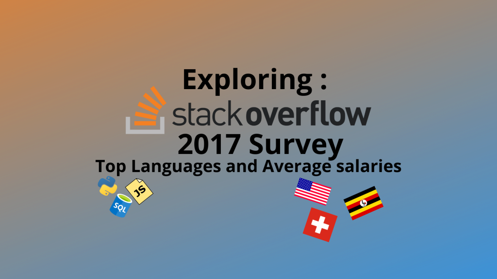
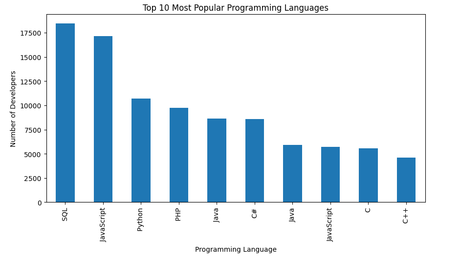
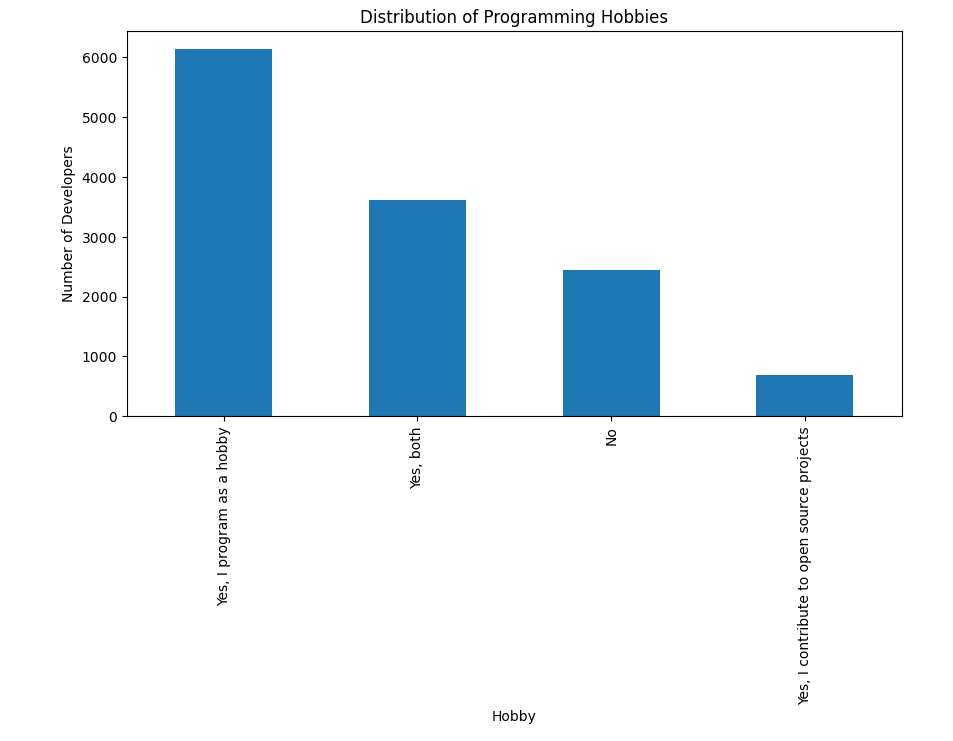
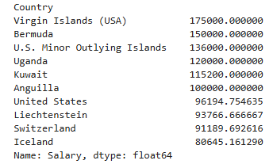
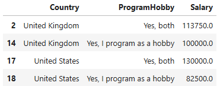
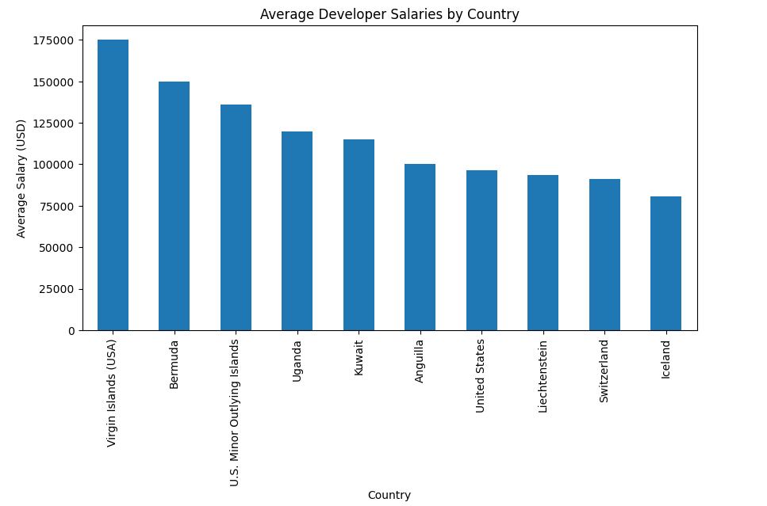

Introduction

In today’s blog, we’ll dive into the 2017 Stack Overflow Developer Survey, a treasure trove of insights about developers worldwide. We’ll analyze five key aspects:

1. The most popular programming languages.

3. Distribution of Programming Hobbies

5. Average developers salaries across countries.

7. Relationship between hobbies and salaries.

9. Average developers salaries by country

This analysis highlights trends in the developer community and provides actionable insights for aspiring developers, hiring managers, and tech enthusiasts.

# Key Questions

To guide our analysis, we addressed three important questions:

1. **Which programming languages are the most popular?**

3. **How do developer salaries compare across different countries?**

5. **How much average salaries of developer in different countries?**

# Methodology

The analysis was performed using Python, leveraging the following steps:

1. **Data Loading**: We loaded the survey data from the publicly available CSV file . We used `pandas` to load the survey data from the CSV file.

3. **Data Cleaning**: We removed missing values and focused on the relevant columns for our questions, Missing values were removed and relevant columns for our questions were filtered using `pandas`.

5. **Analysis**: Insights were extracted by grouping and counting responses, calculating averages, and visualizing data , calculating averages, and visualizing data, with the help of `pandas` .

7. **Visualization**: Bar charts were created to present the findings using `matplotlib`.

# Following CRISP — DM

- **Business Understanding**

- **Data Understanding**

- **Data Preparation**

- **Modeling**

- **Evaluation**

- **Deployment**

# Findings

## 1\. Most Popular Programming Languages

By analyzing the `ProgramHobby` column, we identified the top programming languages developers used in 2017.

**Top 5 Languages:**

1. SQL

3. JavaScript

5. Python

7. PHP

9. Java

This Menu shows that SQL remains the leader, reflecting its dominance in Programming Languages .

## 2.Distribution of Programming Hobbies

Programming isn’t just a profession for many developers — it’s also a passion. The 2017 Stack Overflow Developer Survey revealed some fascinating insights about how developers engage with programming as a hobby:

- **Yes, I program as a hobby**: The majority of respondents (over 6,000 developers) stated that programming is a hobby they enjoy outside of work.

- **Yes, both**: A significant number of developers combine programming as a hobby with contributing to open source projects.

- **No**: A smaller group of respondents indicated that they do not program as a hobby.

- **Yes, I contribute to open source projects**: Some developers primarily focus on open source contributions, showcasing their commitment to community-driven initiatives.

## Visualization:

<figure>

<figcaption>

Distribution of Programming Hobbies

</figcaption>

</figure>

The chart above demonstrates the distribution of responses, highlighting that a significant portion of developers are intrinsically motivated to code, even outside their professional commitments.

## 3\. Developer Salaries Across Countries

We examined the `Salary` column to determine average salaries for developers globally.

**Top 5 Countries by Average Salary (USD):**

1. _United States (including Virgin Islands and U.S. territories): $175,000+_

3. _Bermuda: $150,000+_

5. _Uganda: $120,000+_

7. _Kuwait: $115,000+_

9. _Anguilla: $100,000+_

**Visualization:**

<figure>

<figcaption>

**Top 5 Countries by Average Salary (USD)**

</figcaption>

</figure>

This data provides valuable insights for developers seeking opportunities in high-paying regions.

## 4.Relationship Between Hobbies and Salaries

Does programming as a hobby or contributing to open source projects impact developer salaries? Based on the data from the 2017 Stack Overflow Developer Survey, we can uncover some interesting insights.

## Snapshot of the Data:

## Key Observations:

- **United States**: Developers who both program as a hobby and contribute to open source projects report the highest salaries, with an average of $130,000.

- **United Kingdom**: Developers engaging in programming as both a hobby and open source contributions earn higher salaries than those who only program as a hobby.

## 5.Average Developer Salaries by Country

In the picture , We have Visualization about Average salaries for developers by country .

**Visualization:**

# Conclusion

The 2017 Stack Overflow Developer Survey provides an invaluable glimpse into the developer community. Whether you’re exploring the most in-demand programming languages or considering where to work, these insights can help you make informed decisions.

If you’re interested in the full analysis or the code used, check out the [GitHub repository](https://github.com/Saad711T/Udacity-IntroductionToDataScience).

# Call to Action

Have thoughts about these findings? Share your comments below or contribute to the discussion on [Github](https://github.com/Saad711T/Udacity-IntroductionToDataScience).

