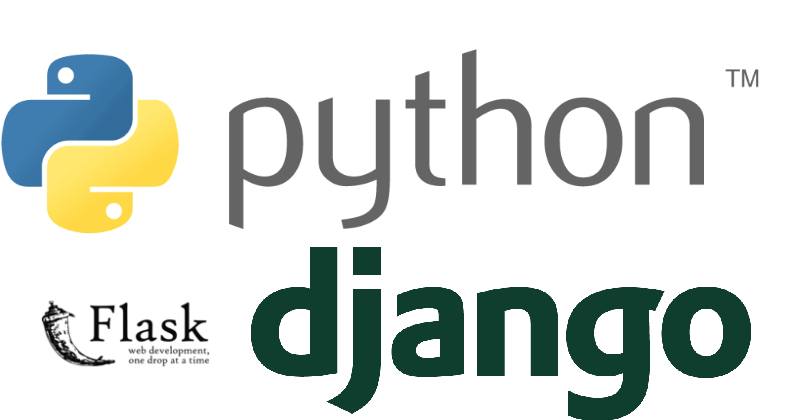
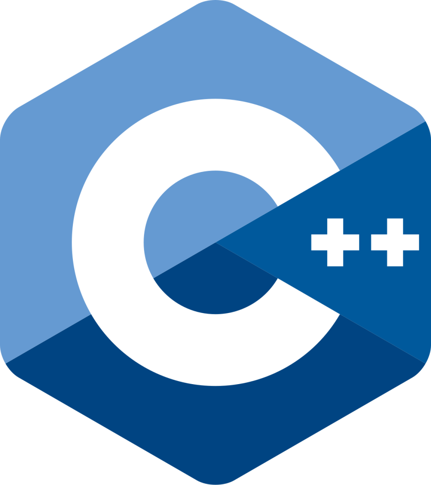

هندسة البرمجيات (Software Engineering) هو مفهوم واسع جداً لدرجة أنه أصبح تخصصاً جامعياً مستقلا بحد ذاته عن علوم الحاسب (Computer Science) وتقنية المعلومات (IT) .

تشمل هندسة البرمجيات عدة أشياء كتطوير البرمجيات بلغات البرمجة وهندسة قواعد البيانات وتحليل البيانات , وطرق إنشاء المشاريع بعدة مفاهيم أبرزها الـAgile والـPlan-Driven

## 1-دراسة المفاهيم

في هذا الفصل يتعلم مهندس البرمجيات مفاهيم هندسة البرمجيات مثل أخلاقيات المهنة والمشاريع الـAgile والـPlan-Driven وأساسيات هندسة البرمجيات , بل ويتعلم كذلك لمحة عن تطور هذا المجال بشكل عام .

## 2-تطوير الويب

أحد أبرز أنواع البرمجيات هي الـ(Web-Based) , وهي تلك البرمجيات المبنية على الويب . بحيث يتعلم بشكل أولي مطور البرمجيات تطوير الويب وتطبيقات الويب . أبرز المهارات في هذا الفصل هو تعلم تطوير الواجهات الأمامية (Front-End) بلغات HTML - CSS - JavaScript .

بعد ذلك سيتم التعمق في تطوير الواجهات الخلفية (Back-End) حيث يتعني المبرمج بالسيرفر وقاعدة البيانات والأوامر اللازمة لتشغيل تطبيق الويب , وأبرز مايتعلمه هو لغات مثل PHP - Python - Java C# ولعل أبرز لغتان هي بي اتش بي وبايثون وتحديدا مكتبة فلاسك وجانجو .

## 3-إحتراف لغة سي بلس بلس

وهي لغة برمجة مهمة للغاية في مجال تطوير البرمجيات والتعامل مع الـHardware والكمبيوتر بكفاءة , تعد خطوة مهمة حتى في تعلم Syntax البرمجة بشكل عام.

## 4-إحتراف لغة جافا

وهي لغة برمجة عالية المستوى مثل سي بلس بلس وبايثون وتعتبر لغة كذلك مهمة وشاملة في عدة مجالات , وتستخدم بشكل رئيسي في تطوير تطبيقات الـAndroid . وتعتبر جنباً إلى جنب مع Kotlin و Swift و Dart مدخلاً لتطوير تطبيقات الهاتف المحمول .

## 5-تطوير البرمجيات

تطوير البرمجيات بإستخدام فيجوال ستوديو وفريموورك .NET ولغة C# , C++ مهم للغاية في عملية سير تطوير البرمجيات .

## 6-قواعد البيانات

الإطلاع على قواعد البيانات العلائقية بإستخدام SQL وبإستخدام مختلف الRDBMS مثل MySQL - OracleDB - SQL Server مهماً للغاية , كذلك ينبغي الإطلاع على الNoSQL والتي تعتبر MongoDB أشهر نوعاً فيها , تكمن أهمية قاعدة البيانات بحفظ البيانات الخاصة بموقع الويب أو البرمجية الخاصة بك .

## 7-الDevOPS - Docker - Git/Github

إتقان أدوات وأشياء مثل Docker (حاويات البيانات) و Git/Github شيئاً مهماً في مجال هندسة وتطوير البرمجيات , وكذلك تكمن وظيفة الDevOPS بأنه يجمع بين وظيفة المطورين ووظيفة مجربين البرنامج ويجب أن يكون لديه إحترافية عملية ومهارات عالية خاصة بكل الطرفين .

# خاتمة

ختاماً لم نذكر كافة الأشياء الموجودة في هذا المجال , لكننا ذكرنا الأساسيات والأشياء المهمة . هندسة البرمجيات كذلك تتداخل مع عدة مجالات مثل إدارة المشاريع (Project Management) ومناهج البرمجة (Programming Paradigms) وتطوير الويب (Web Development) وإلخ .
