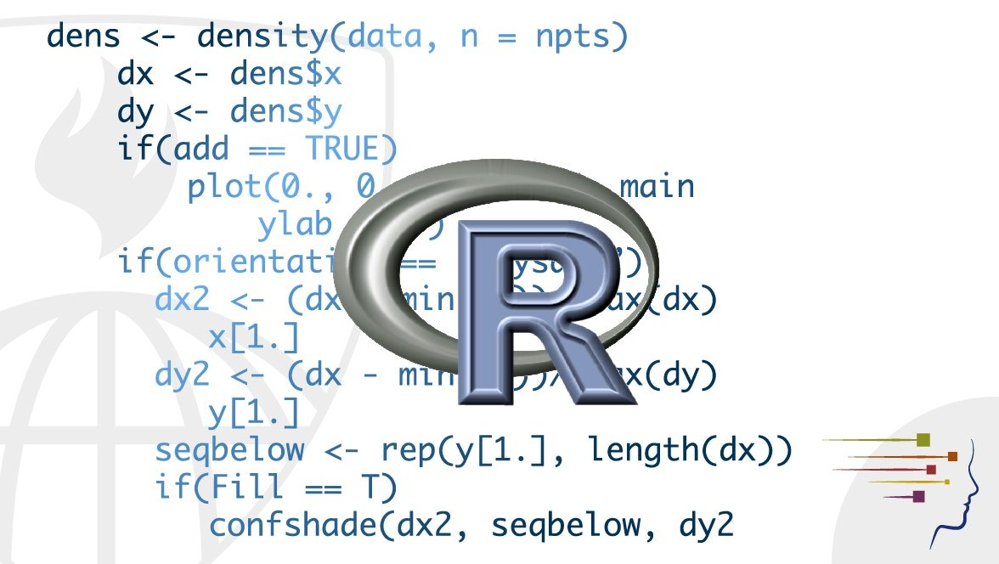
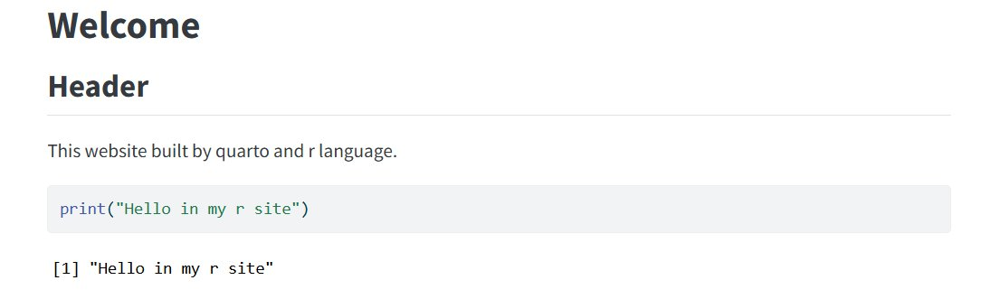

# تجربة غريبة : صناعة موقع بلغة آر

من أكثر التجارب الغريبة اللي سويتها , بناء موقع إلكتروني بلغة فقط للإحصاء وتحليل البيانات

`R language`

راح أتكلم عن التجربة الكاملة مع مستودع Github

## نبذة

أول شيء لغة آر هي لغة برمجة مختصة بشكل كبير في الرياضيات (وتحديداً الإحصاء وبحوث العمليات) وأيضاً تحليل البيانات

وطبعاً أصبحت غير شائعة بسبب أن بايثون شاملة وأفضل منها , وكذلك وضحت أن لغة آر فقط لغة للإحصاء وأمور بسيطة وليست مثل بايثون .

## الطرق

فيه طريقتين

1. عن طريق مكتبة Distill
2. عن طريق مكتبة Quarto وهي مكتبة تنفيذ أكواد جوبيتر (بايثون - جوليا - آر) في المواقع الإلكترونية مع مولد مواقع static بالماركداون مثل jekyll و hugo والخ... وطبعاً المكتبة ذي مدعومة وبقوة في RStudio .

كتبت الواجهات بqmd وهي الماركداون المخصص لمكتبة quarto ونفذت فيها أكواد آر قوية شوي بالبداية ثم أكتفيت بأمر print بسبب ضغط الموقع .

طبعاً ربطتها بgithub وصار الdeploy تلقائي على Netlify بطريقة github workflows بملفات الyml .

<a href="https://github.com/Saad711T/R-Site">رابط الريبو</a>

 

<a href="https://rsite1.netlify.app">الموقع</a>

